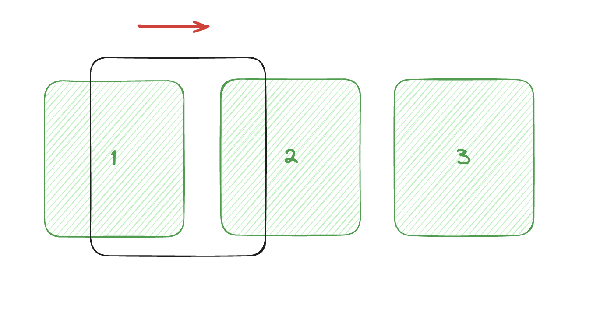

## About RNRC
关于RNRC(react-native-reanimated-carousel)的内部实现。

### 工作原理
这是我们期望看到的执行逻辑。

1. 首先我们默认有三张图片，并且已经滑动到了中间第二张

2. 我们拖动图片向右滑动


3. 当第一张图片的部分进入轮播图视窗超过1/2后，我们将末尾的图片挪动到最前面

4. 这样我们就完成了一次向一侧的循环滚动，反方向同理。其实原理就是滑动并且追加，这里依赖reanimated实现，所以整个处理逻辑依然在UI线程完成，图片的挪动并不会导致动画卡顿。


在代码中它的运行方式是这样的。  

> 我认为我并没有讲清楚这部分逻辑，但这已经是修改很多遍后的版本了，这是一个复杂的过程，如果有任何伙伴有了自己的理解，欢迎提交PR，我们来让这个讲解变得更清晰。  
> 并且我认为这部分内容，对于项目开发初期无疑是非常重要的，但就目前来看已经变得不再那么"重要"，因为这部分底层内容应该也不再会有大幅变动，如果感兴趣可以了解，否则我认为不是很有必要弄懂。

1. 首先我们需要一个单位`size`，它用来帮我们计算滚动距离，当水平时`size`等于`width` prop的设置，当垂直时`size`等于`height` prop的设置。

2. 其次我们需要一个值`handlerOffset`，用来记录当前的滚动距离，这是一个总值，当我们滚动两张，那`handlerOffset`等于size * 2，如果滚动十张那`handlerOffset`等于size * 10。

3. 紧接着是处理如何让末尾的元素在合适的时候挪动到最前面，这部分逻辑在`./src/hooks/useOffsetX.ts`中。首先我们需要知道目前的视窗大小（一侧元素渲染的总数量），视窗大小默认为元素总数量的一半，即全量渲染。


通过视窗大小的值我们可以计算出，正向或者反向元素末端的位置.


然后我们需要找到界限（判断图片是否挪动到最前面的那个位置）。目前我们设置这个位置为一侧的总长度加元素一半大小，这个位置会受视窗大小所影响，可以通过`windowSize` prop来修改。比如，当不设置`windowSize`时，并且数据长度为5时，则一侧长度为size * (5-1)/2 = size * 2，那么界限为size * 2 + size * 0.5，如果修改`windowSize`为3，则一侧长度为size * (3-1)/2 = size * 1，那么界限为size * 1 + size * 0.5。


为了控制元素位置更加直观，我们将元素都位于了原点，它们都会重合在原点，`translateX:0`。在这种情况下，我们需要计算出每个元素的基础位置`startPos`，这个值是根据元素的索引来计算的，比如第一张图片的基础位置是0，第二张图片的基础位置是size，第三张图片的基础位置是size * 2，以此类推。 然后保持每个元素相对的位置关系，我们要让每个元素减去自身的基础位置`startPos`，并且再加上最小的边界值`Number.MIN_VALUE`，这样我们能获得越过`界限`则立刻触发更换位置的逻辑，它会自动通过`outputRange`进行转换。

上面的逻辑转化为代码如下：

```tsx
    const inputRange = [
        -TOTAL_WIDTH,
        MIN - HALF_WIDTH - startPos - Number.MIN_VALUE,
        MIN - HALF_WIDTH - startPos,
        0,
        MAX + HALF_WIDTH - startPos,
        MAX + HALF_WIDTH - startPos + Number.MIN_VALUE,
        TOTAL_WIDTH,
    ];
    const outputRange = [
        startPos,
        MAX + HALF_WIDTH - Number.MIN_VALUE,
        MIN - HALF_WIDTH,
        startPos,
        MAX + HALF_WIDTH,
        MIN - HALF_WIDTH + Number.MIN_VALUE,
        startPos,
    ];
    return interpolate(
        handlerOffset.value,
        inputRange,
        outputRange,
        Extrapolate.CLAMP
    );
```

4. 现在我们获得了一个非常好用的x值，它是一个针对不同index都有不同表现的x值，比如，当我们想让第二个元素在第一个元素后面时，就可以做如下设置
```tsx
const inputRange = [-1, 0 ,1]
const outputRange = [-size, 0 ,size]
return {
    transform: [
        { translateX: interpolate(handlerOffset.value, inputRange, outputRange) },
    ],
}
```
这样第一张位于原点`translateX:0`时，下一张位于`translateX:size`,因为第一张收到的x值是0，第二张此刻收到的x值将会是1。而且如果我们继续向左侧拖动，那么-1会接近-1.5，按照我们的逻辑，当超过-1.50000...00001时，位于最左侧的图片收到的x值会瞬间变成1.49999...00001，这样就会触发更换位置的逻辑。


### 目录结构
```
./src
├── Carousel.tsx # RNRC组件的`入口文件`
├── LazyView.tsx # 根据 `shouldUpdate` prop, 控制是否展示元素
├── ScrollViewGesture.tsx # 手势逻辑的`入口文件`
├── constants
│   └── index.ts # 常量定义
├── hooks
│   ├── useAutoPlay.ts # 管理自动播放
│   ├── useCarouselController.tsx # 管理轮播图行为的控制器（上一张、下一张...）
│   ├── useCheckMounted.ts # 检查轮播图是否已经挂载完成
│   ├── useCommonVariables.ts # 从Props中取出一些公共变量
│   ├── useInitProps.ts # 对传入的Props做初始化定义
│   ├── useLayoutConfig.ts # 根据指定的不同mode（parallax、horizontal-stack...）返回不同的AnimationStyle
│   ├── useOffsetX.ts # 何时将下一张挪动到最前面的核心逻辑
│   ├── useOnProgressChange.ts # 监听滚动进度变化
│   ├── usePropsErrorBoundary.ts # 用于捕获Props的设置错误
│   └── useVisibleRanges.tsx # 管理轮播图的可见范围
├── index.tsx
├── layouts # 定义了一些基本Layout
│   ├── BaseLayout.tsx
│   ├── ParallaxLayout.tsx
│   ├── index.tsx # Layout的`入口文件`，返回定义好的各种AnimationStyle.
│   ├── normal.ts
│   ├── parallax.ts
│   └── stack.ts
├── store
│   └── index.ts # 存储Props和一些基础变量的ContextStore
├── types.ts # 类型定义
└── utils # 一些工具方法
    ├── computedWithAutoFillData.ts # 当默认数据不足时，将会自动补全数据，也可以通过`autoFillData` prop来关闭，所以这个文件内提供了处理两种不同情况的方法。
    ├── dealWithAnimation.ts # 封装处理Spring/Timing两种动画类型
    └── log.ts # 用来在`worklet`函数中打log的工具方法
```

### 开始开发
1. 在根目录中执行`yarn dev`。
2. 在exampleExpo执行`yarn ios/ yarn android/ yarn web`。
3. 修改`./src/*`下的文件将会看到变化。

### 提示

如何增加一个新的动画效果？ 

我们鼓励大家使用[`customAnimation`](./custom-animation.zh-CN.md) prop来完成它，因为这是一个更加灵活且简单的方式。 

1. 在`./exampleExpo/src/[new example]`中参考其它的example来制作一个新的动画效果，并给它起一个名字（kebab-case 短横线命名）。
2. 在`./exampleExpo/src/Home.tsx`文件中来添加入口路由。
3. 录制演示动画，我们推荐大家按照1.8:1的大小来进行录制，一般来说按照其他演示gif的比例即可，最后将录制的动画放到`./scripts/gif-works-directory`中，执行`yarn gif`将会自动在此目录生成gif文件。
4. 将gif文件放到`./assets`目录中，并按照类型更新`README.md`与`README.zh-CN.md`文件。

